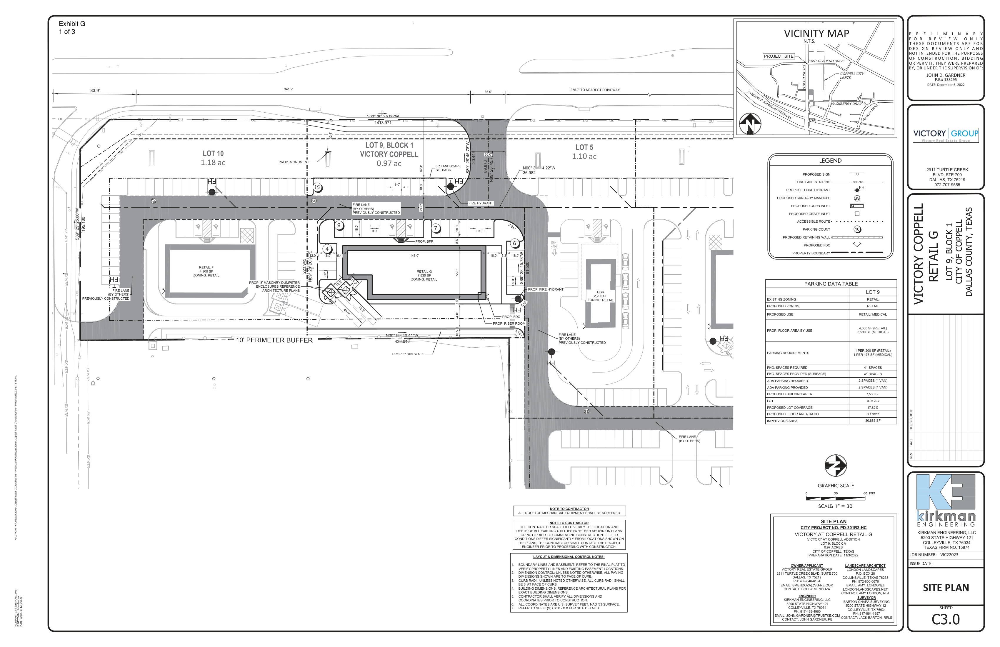

# Hatch Matching Challenge

Given a native-resolution construction drawing and a rectangular example of a hatch pattern, return a binary mask identifying the same pattern in that drawing. Evaluation uses explicitly annotated pixels and excludes supplied query and context regions.

[Live visual examples](https://trutec-ai.github.io/hatch-matching-challenge/) · [Technical specification](SPECIFICATION.md) · [Dataset](DATASET.md) · [Metrics](BENCHMARK.md) · [Submission](SUBMISSION.md)

[](https://trutec-ai.github.io/hatch-matching-challenge/)

Explore three real training drawings in the **[interactive gallery](https://trutec-ai.github.io/hatch-matching-challenge/)**, with query crops and explicitly reviewed matching/non-matching regions. Gallery annotations are examples of the data contract, not predictions.

## Get started

Use Python 3.11 or newer:

```bash
git clone https://github.com/TruTec-AI/hatch-matching-challenge.git
cd hatch-matching-challenge
python -m venv .venv
source .venv/bin/activate
python -m pip install -r requirements.txt
```

On Windows, activate with `.venv\Scripts\activate` instead. The dependencies are for scoring and data checks; inference dependencies are defined by your submission.

## Dataset

The challenge contains **545 query–drawing examples: 289 real queries and 256 generated CAD queries**. The public archive contains 505 examples; 40 real examples remain private for organizer evaluation.

| Partition | Queries | Real | Generated CAD | Real document groups |
|---|---:|---:|---:|---:|
| Public training | 448 | 192 | 256 | 62 |
| Public validation | 57 | 57 | 0 | 13 |
| Private test | 40 | 40 | 0 | 14 |

All generated CAD is training-only. Real document groups are disjoint across partitions; related queries and known document aliases stay together. Private test is participant-heldout, not claimed untouched by prior internal development.

Download the approximately **403 MiB** public archive without authentication ([direct ZIP](https://github.com/TruTec-AI/hatch-matching-challenge/releases/download/dataset-v1/trutec-hatch-dataset-v1.zip)), or use the verified downloader:

```bash
python download_data.py
```

The downloader uses [the pinned release descriptor](data/release.json). The archive includes `train.json`, `val.json`, original PNG assets, checksums, and separate expected annotation counts. See [DATASET.md](DATASET.md) and [DATA_TERMS.md](DATA_TERMS.md).

## Inference and evaluation

Create label-free validation requests:

```bash
python make_inputs.py --manifest dataset/val.json --output validation-inputs.json
```

The submitted inference entry point must support:

```bash
python your_inference.py --inputs validation-inputs.json --data-root dataset --output-dir predictions
```

Write one binary PNG at `predictions/<id>.png` for every request, at the original drawing dimensions. Images, query rectangles, and supplied context rectangles are inference inputs. Annotation masks, annotation rectangles, expected counts, and private labels are not.

Score the predictions:

```bash
python evaluate.py --manifest dataset/val.json --data-root dataset --predictions predictions --output metrics.json
```

Missing predictions, unsupported encodings, and dimension mismatches fail validation. The scorer never resizes masks. Read [SPECIFICATION.md](SPECIFICATION.md) for the exact input, output, annotation, and scoring contracts.

## Performance context

A measured reference system achieved **73.73% document-macro IoU** on a separate, previously exposed development suite of **37 real queries across 12 documents**. This is **not a score on the new challenge validation or private-test partition**.

An aspirational public-validation target is **75%+ document-macro IoU**, with recall near or above **95%**, while reporting precision and reviewed-blank false positives. These targets are context, not measured challenge results or application acceptance thresholds. See [BENCHMARK.md](BENCHMARK.md) for exact reference values and denominators.

## Submit

Email **[ryan@trutec.ai](mailto:ryan@trutec.ai)** with the repository URL, immutable commit, submission manifest, results, and artifact links. Follow [SUBMISSION.md](SUBMISSION.md), complete [submission.example.json](submission.example.json), and validate it:

```bash
python validate_submission.py --submission submission.json
```

Code: [MIT](LICENSE). Dataset use: separate [DATA_TERMS.md](DATA_TERMS.md).
