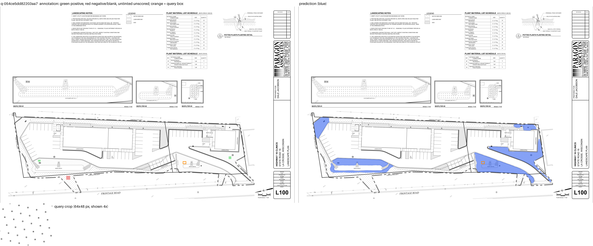
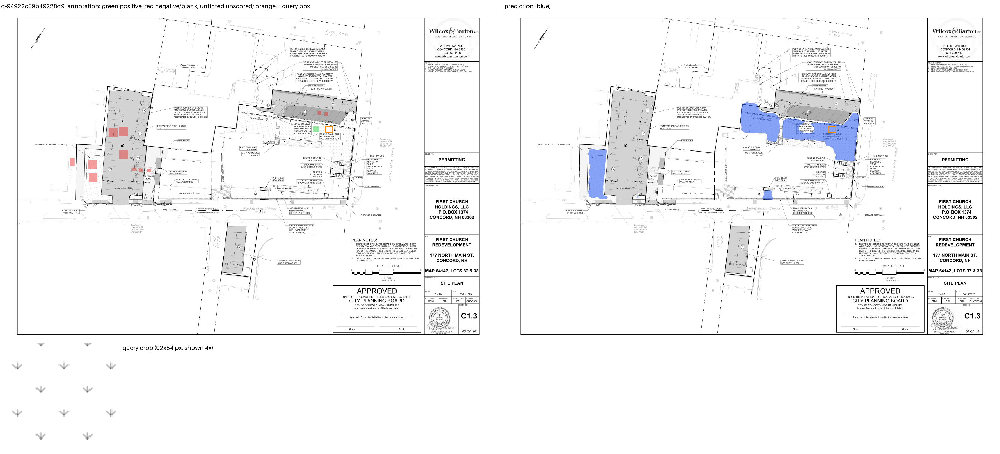
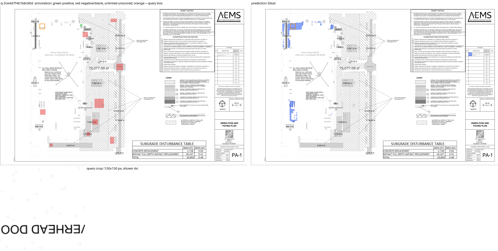

# Hatch matching: technical report

Repository: https://github.com/TarunYadgirkar/extra, branch `claude/dino-head` (the commit is in `submission.json`). Upstream challenge: TruTec-AI/hatch-matching-challenge.

## Input and output contract

`python solution/infer.py --inputs validation-inputs.json --data-root dataset --output-dir predictions` reads the label-free request list written by `make_inputs.py` (id, image, width, height, query_box, context_boxes). Any other field in a request is rejected. For every request it writes `predictions/<id>.png`, a binary 8-bit PNG (0 or 255) at the drawing's native size. Only the drawing pixels and the query rectangle are used; the context rectangles are accepted and ignored. Annotation masks, annotation rectangles, expected counts and private labels are never read at inference time.

## Method

1. Patch features from DINOv2 ViT-S/14 with registers (timm `vit_small_patch14_reg4_dinov2.lvd142m`, Hub revision pinned in `solution/features.py`), extracted in overlapping 518 px tiles at 0.5x and 1x scale. The last four transformer blocks and the final norm were fine-tuned on the public training split with a query-conditioned objective (balanced BCE on the cosine between each cell and the query prototype, and on the top-3 cosine to the query cells); the pretrained weights of the other eight blocks are unchanged. `solution/weights/dino_ft.pt` holds the fine-tuned parameters (28 MB).
2. Per-location features on a 4 px grid (`pixfeat.py`): cosine, robust and top-k similarity to the query cells, exemplar-LDA whitened against the drawing's own feature statistics, tone and ink statistics, orientation and intensity histograms, each compared with the query.
3. Query-conditioned texture features (`texfeat.py`): a log-polar power spectrum (line spacing by angle), ink-blob size-class densities and normalized cross-correlation of query crops.
4. A scikit-learn `HistGradientBoostingClassifier` (`solution/weights/head.joblib`, 162 columns, 400 trees) trained on the public training split, real and generated CAD queries, 2500 positive and 2500 negative labeled pixels per query. Its training rows were extracted with backbones fine-tuned on the other cross-validation folds (cross-fitting), so the head learns on features of the same quality it meets at inference.
5. Post-processing on the probability grid: Gaussian blur (sigma 14 px), filling of enclosed below-threshold holes that do not touch the drawing border, threshold 0.5, bilinear upsampling to native size.

## Reproducibility

`solution/ENVIRONMENT.md` gives the interpreter, the pinned dependencies and the install steps. The only network access is the pretrained DINOv2 checkpoint download from the Hugging Face Hub on first use. `AGENTS.md` ("Rebuilding the weights from scratch") lists the exact commands that produce `dino_ft.pt` and `head.joblib` from the public training split; `solution/EXPERIMENTS.md` records every experiment and its cross-validation and validation numbers. Dataset: the public release in this repository's `download_data.py` (`dataset/checksums.json`), evaluator `evaluate.py` at the submitted commit.

## Measured results on the public validation set

Unedited evaluator output: `solution/submission/metrics.json` (SHA-256 in `solution/submission/SHA256SUMS`, next to `predictions-val.zip`, the 57 native-resolution prediction PNGs).

| Metric | Value |
|---|---|
| document-macro IoU | 0.9420 |
| mean query IoU | 0.8732 |
| global precision | 0.7985 |
| global recall | 0.9700 |
| examples scored / documents | 57 / 13 |
| positive-only examples | 2 |
| tp / fp / fn pixels | 620467 / 156553 / 19161 |

Per document:

| Document | IoU |
|---|---|
| doc-796851cb2de5c8b5 | 0.7437 |
| doc-c3c44da23bd68a02 | 0.7520 |
| doc-e86e6e54f74f7d06 | 0.7860 |
| doc-8447ed6c6eb83943 | 0.9638 |
| doc-1848fb7d18a22fa4 | 0.9998 |
| doc-2e414058d1bb8c45 | 1.0000 |
| doc-2f69e1183867e83c | 1.0000 |
| doc-435d842a0d0e7dbd | 1.0000 |
| doc-77f8e646c47f7f68 | 1.0000 |
| doc-a859f9d54429d4b7 | 1.0000 |
| doc-cfe224919ed03bf8 | 1.0000 |
| doc-d4324654d593e7af | 1.0000 |
| doc-f367a5c59338c74b | 1.0000 |

The previous deployed version of this pipeline, with frozen DINOv2 features and a head trained on them, scored 0.9241 on the same set; the fine-tuned backbone adds +0.018. Historical numbers from other suites (the upstream reference at 0.737) are not comparable with these.

On the training split, the four-fold document-grouped cross-validation of the head reaches 0.902 document-macro IoU against 0.890 for the frozen-feature version. A paired per-document bootstrap gives +0.013 with a 95% interval of [-0.007, +0.034]; the gain is consistent across two fine-tuning seeds and a fully nested rerun, and it is concentrated in queries larger than 60 px, while queries under 40 px lose on average.

## Timing and hardware

Hardware: Apple M5 Pro (15 cores), 24 GB unified memory, PyTorch on the MPS backend, macOS 27.0. No discrete accelerator.

- Full validation run, 57 queries on 14 drawings: 4306 s wall time as reported by `infer.py` (extraction, feature computation, head prediction and PNG writing for all queries; excludes about 10 s of process start, backbone and head loading). The machine was in macOS low power mode for most of this run; the first 8 queries, before the slowdown, took 201 s (25 s per query), which matches earlier runs of the same pipeline (about 22 s per query).
- Three queries on one 7200x4800 drawing, measured with `/usr/bin/time -l` including process start and model loading: 76.7 s real, peak resident set size 4.36 GB (measured, not estimated). The full run's peak was not measured separately; the largest drawing is 8400x6000, so expect somewhat more.

## Limitations and failure cases

- Label semantics. Training labels treat a flat fill whose tone matches a textured query as a match about 92% of the time; validation document 796851 labels the same situation negative. The five low queries on that document (IoU 0.19 to 0.73) are all this case (figure 2). Training labels are also lenient about 90 degree rotations of the query pattern where validation is strict.
- Sparse patterns with text or symbols inside them (document e86e6e, figure 3) give partial masks: the sparse-dot hatch is matched, but the model also accepts other sparse regions and misses parts where text dominates the cell.
- Tiny queries. Query boxes under about 40 px yield one or two feature cells at the two scales, and prototypes built from them are less reliable with the fine-tuned features than with frozen ones; two 32 px queries on document c3c44da score 0.25.
- Every output is a hard mask at threshold 0.5. An oracle per-query threshold would add about 0.02 on validation, but no label-free predictor of that threshold was found.

## Visual examples

Each figure shows the drawing at 0.25x with the query rectangle in orange. Left: reviewed annotation, green = positive, red = negative or blank, untinted = unscored. Right: the prediction in blue. Below: the query crop at 4x.

1. `q-054ce5dd82203aa7` (document 77f8e6, IoU 1.00): a 64x48 px dot-pattern query on a landscape plan; both bio-filter lots and the strip along the road are matched.
   
2. `q-94922c59b49228d9` (document 796851, IoU 0.19): a 92x84 px query on a hatched-on-gray parking area; the prediction also covers the flat gray lot on the left, which the reviewed labels mark negative.
   
3. `q-2ce4d7f461b8c90d` (document e86e6e, IoU 0.26): a 130x130 px sparse-dot query with the text "OVERHEAD DOOR" running through it; the prediction finds the dotted strip but is fragmented and picks up other sparse regions.
   

## Disclosure

- Training data: the public training split only (192 real and 256 generated CAD queries). No validation labels, private data or synthetic data were used for training. External pretrained artifact: DINOv2 ViT-S/14 reg4 (LVD-142M pretraining) from the timm Hub mirror, used as initialization and partly fine-tuned as described.
- Validation influence: model selection followed a two-stage rule, training-split cross-validation first and public validation second. Validation scores were computed for every experiment listed in `solution/EXPERIMENTS.md` and did influence which candidates were kept (in particular the choice of the fine-tuned backbone over the frozen one, where cross-validation was favourable but not conclusive, and the confirmation of the blur-and-fill post-processing). No parameter was fitted to validation labels; the decision threshold is the default 0.5 and the post-processing constants were chosen on cross-validation.
- The code and experiments were written with Claude Code (Anthropic) operated by the author.
